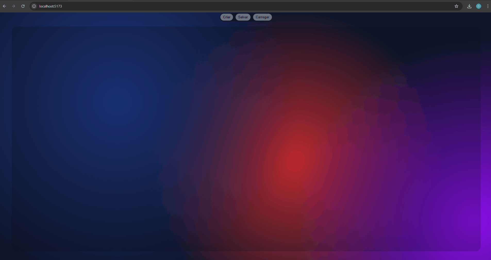

<div align="center">
  <h1>☁️ SkyCast Atlas</h1> 
  <p><strong>Weather Intelligence Dashboard • React + TypeScript</strong></p>
  <h2>🎥 Preview</h2>
  <p align="center">
    
  </p>
  <p>
    
    
    
    
    
    
  </p>
</div>

---

### ✨ Visão Geral

O **SkyCast Atlas** marca minha transição para o ecossistema React. É uma plataforma de monitoramento climático que combina consumo de APIs assíncronas, gerenciamento de estado e uma interface moderna com foco em UX.

> **Note:**
> Evolução direta do motor Vanilla anterior, agora aplicando hooks customizados e renderização.

---

### 🏗️ Funcionamento (O Diferencial)

O projeto foca em performance e modularidade, utilizando **TanStack Query** para cache inteligente de dados e **CSS Modules** para escopo isolado de estilos.

#### 🔄 Destaques Técnicos
- **Hooks Customizados:** Lógica de busca e tratamento de dados encapsulada no `useWeather`.
- **Persistência de Localização:** Sistema de Save/Load integrado ao `localStorage` para gerenciar cards de cidades favoritas.
- **Glassmorphism UI:** Interface baseada em camadas de transparência, `backdrop-filter` e variáveis CSS para um design dark moderno.

---

### 🚀 Funcionalidades

- **Previsão Detalhada:** Visualização de dados atuais, previsão por dias e detalhamento por horas. 
- **Gestão de Cards:** Adicione, salve e remova múltiplas localizações de forma dinâmica.
- **UX Adaptativa:** Scroll horizontal customizado para navegação entre horários e suporte total a dispositivos móveis.
- **Data Insights:** Monitoramento de visibilidade, velocidade do vento e probabilidade de precipitação. 

---

### ⚙️ Recursos Técnicos

#### Snapshot do Layout
O sistema utiliza **html-to-image** para capturar o estado visual do dashboard antes do salvamento.

Isso permite persistir layouts completos com preview visual.

#### Sistema de Persistência
Dois níveis de armazenamento local:

1. **Card Individual**
  - cidade
  - latitude
  - longitude

2. **Layout Completo**
  - posição dos cards
  - configurações visuais
  - snapshot do estado da interface

---

### 🛠️ Tech Stack

- **Core:** React 19 + TypeScript (Strict Mode).
- **Data Fetching:** TanStack Query (React Query). 
- **Estilização:** CSS Modules com suporte a Glassmorphism. 
- **Build Tool:** Vite para um ambiente de desenvolvimento ultra rápido.

---

### 🌐 APIs Utilizadas

O projeto integra duas APIs externas para fornecer dados climáticos e geográficos.

#### Open-Meteo
Responsável pelos dados meteorológicos:

- Temperatura
- Velocidade do vento
- Visibilidade
- Probabilidade de precipitação
- Previsão horária e diária

#### OpenCage Geocoding
Utilizada para **reverse geocoding**, convertendo coordenadas geográficas em nomes de cidades.

#### ⚙️ Data Pipeline

<table align="center" width="100%">
  <tr width="100%">
    <td align="center" width="47.5%">
      <strong>1. Geolocalização</strong>
      <code>📍 User Coords</code>
    </td>
  </tr>
  <tr><td align="center" width="5%">⬇</td></tr>
  <tr width="100%">
    <td align="center" width="47.5%">
      <strong>2. Weather Engine</strong>
      <code>☁️ Open-Meteo API</code>
    </td>
  </tr>
  <tr><td align="center" width="5%">⬇</td></tr>
  <tr width="100%">
    <td align="center" width="47.5%">
      <strong>3. Reverse Geocoding</strong>
      <code>🗺️ OpenCage Data</code>
    </td>
  </tr>
  <tr><td align="center" width="5%">⬇</td></tr>
  <tr width="100%">
    <td align="center" width="47.5%">
      <strong>4. UI Delivery</strong>
      <code>🎴 Dynamic Card</code>
    </td>
  </tr>
</table>

---

### 📦 Bibliotecas Integradas

- **Leaflet** → renderização de mapa interativo
- **TanStack Query** → gerenciamento de cache e requisições
- **html-to-image** → captura do layout para salvar snapshots

---

### 📁 Estrutura do Projeto

```plaintext
src/
├── assets/       # Ícones
├── components/   # Componentes reutilizáveis
├── features/     # Módulos isolados (Weather, Locations)
├── hooks/        # Hooks customizados
├── pages/        # Páginas da aplicação
├── services/     # Queue de requisições
├── styles/       # Estilos globais
├── types/        # Tipos TypeScript
└── utils/        # Funções auxiliares
```

---

### 🧠 Arquitetura

O projeto segue um modelo **feature-based structure**, onde cada módulo contém seus próprios componentes e lógica.

Benefícios:

- isolamento de responsabilidades
- escalabilidade
- manutenção facilitada

---

### ⚡ Getting Started

<table width="100%"> 
  <tr> <td> <p><strong>1. Clonar</strong></p> <pre><code>git clone https://github.com/Caue-Lacerda/SkyCastAtlas.git</code></pre> </td> </tr> 
  <tr> <td> <p><strong>2. Entrar no diretório</strong></p> <pre><code>cd SkyCastAtlas</code></pre> </td> </tr> 
  <tr> <td> <p><strong>3. Instalação</strong></p> <pre><code>npm install</code></pre> </td> </tr> 
  <tr> <td> <p><strong>4. Start</strong></p> <pre><code>npm run dev</code></pre> </td> </tr> 
</table>

### 🔑 Environment Variables

Para executar o projeto corretamente é necessário configurar uma chave de acesso para o serviço de **reverse geocoding** utilizado pela aplicação.
1. Abra o arquivo `.env` localizado na raiz do projeto.
2. Localize a variável:
<pre><code>VITE_OPENCAGE_API_KEY=false</code></pre> 
3. Substitua o valor `false` pela sua chave da API: 
<pre><code>VITE_OPENCAGE_API_KEY=your_api_key_here</code></pre> 
A chave é utilizada para integrar a API de geocodificação da **OpenCage**, responsável por converter **coordenadas geográficas (latitude e longitude)** em **nomes de cidades**, permitindo que os cards do dashboard exibam corretamente o nome da localização consultada.

📚 Documentação oficial da API:  
https://opencagedata.com/api

---

## 🚀 Deploy

O projeto está hospedado na **Vercel**, utilizando integração contínua com GitHub para deploy automático a cada atualização na branch principal (`main`).

---

### 🔗 Links Úteis
<table width="100%"> 
  <tr> <th align="left">Recurso</th> <th align="left">Link</th> </tr> 
  <tr> <td>🚀 <strong>Deploy Oficial</strong></td> <td><a href="https://sky-cast-atlas.vercel.app/">Visualizar na Vercel</a></td> </tr> 
  <tr> <td>📚 <strong>Documentação API</strong></td> <td><a href="https://open-meteo.com/en/docs">Open-Meteo</a></td> </tr> 
  <tr> <td>📚 <strong>Documentação API</strong></td> <td><a href="https://opencagedata.com/api">OpenCage</a></td> </tr> 
</table>